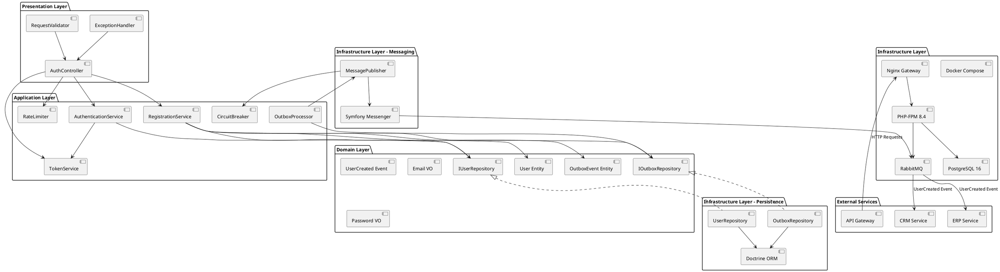
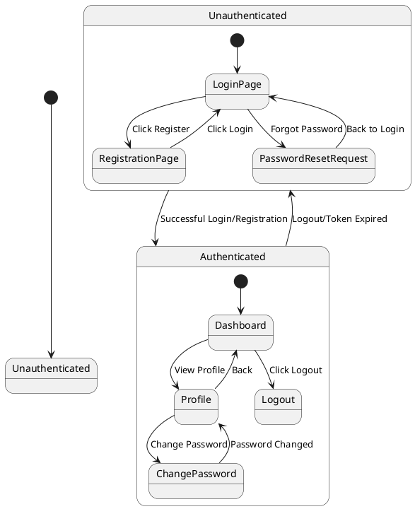
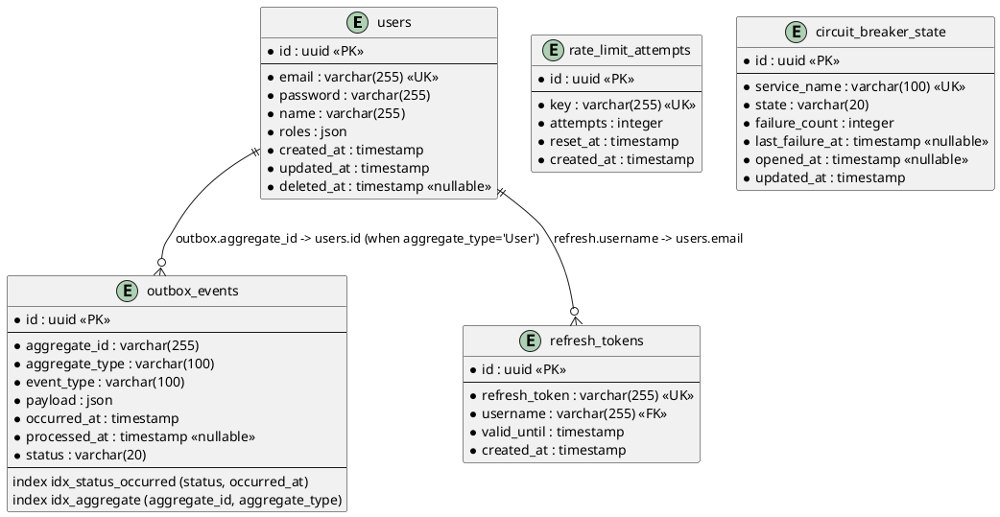

# Authentication Microservice - System Design Document

## Implementation Approach

We will implement a production-ready Authentication Microservice using Symfony 7 and PHP 8.4 following Clean Architecture and SOLID principles. The implementation will be carried out in the following phases:

1. **Infrastructure Setup**
   - Configure Docker multi-stage build with PHP 8.4-fpm, Nginx, PostgreSQL, and RabbitMQ
   - Setup network isolation for microservices communication
   - Configure environment-based configuration management

2. **Domain Layer Implementation**
   - Design User entity with proper value objects (Email, Password, UserId)
   - Implement Outbox Pattern for reliable event publishing
   - Create domain events (UserCreated, UserAuthenticated)
   - Apply Repository pattern for data access abstraction

3. **Application Layer Services**
   - RegistrationService: Handle user registration with transactional outbox
   - AuthenticationService: JWT token generation and validation
   - OutboxProcessor: Process outbox events and publish to message broker
   - Implement CQRS pattern for read/write separation

4. **Security Infrastructure**
   - Configure LexikJWTAuthenticationBundle with RS256 algorithm
   - Implement json_login firewall for stateless authentication
   - Setup RSA key pair generation and management
   - Configure CORS for API Gateway integration

5. **Reliability Patterns**
   - Circuit Breaker for external service calls
   - Rate Limiter for API endpoints protection
   - Retry mechanism with exponential backoff for message publishing
   - Health check endpoints for orchestration

6. **Observability**
   - Structured logging with Monolog
   - Metrics collection endpoints
   - Request tracing correlation IDs

## Main User-UI Interaction Patterns

1. **User Registration Flow**
   - User submits registration data (email, password, name) via POST /api/register
   - System validates input and creates user account
   - JWT token is returned immediately for seamless onboarding
   - Asynchronous event is published to notify other services

2. **User Authentication Flow**
   - User submits credentials via POST /api/login
   - System validates credentials against database
   - JWT access token (15min TTL) and refresh token (7 days TTL) are returned
   - Token contains user claims (id, email, roles)

3. **Token Refresh Flow**
   - User submits refresh token via POST /api/token/refresh
   - System validates refresh token signature and expiration
   - New access token is issued
   - Refresh token is rotated for security

4. **Token Validation Flow (Gateway)**
   - API Gateway receives request with JWT token
   - Gateway validates token signature using public key
   - Gateway extracts user claims and forwards to downstream services
   - No database call required (stateless)

5. **Password Reset Flow**
   - User requests reset via POST /api/password/reset-request
   - System generates secure token and sends email
   - User submits new password with token via POST /api/password/reset
   - Password is updated and all existing tokens are invalidated

## Architecture

## UI Navigation Flow

## Class Diagram

```plantuml
@startuml

' Domain Layer - Value Objects
class Email {
    - value: string
    + __construct(string $email)
    + getValue(): string
    + equals(Email $other): bool
    {static} + fromString(string $email): self
}

class Password {
    - hashedValue: string
    + __construct(string $plainPassword)
    + verify(string $plainPassword): bool
    + getHash(): string
    {static} + fromHash(string $hash): self
}

class UserId {
    - value: string
    + __construct(?string $id = null)
    + getValue(): string
    + equals(UserId $other): bool
    {static} + generate(): self
}

' Domain Layer - Entities
class User {
    - id: UserId
    - email: Email
    - password: Password
    - name: string
    - roles: array<string>
    - createdAt: DateTimeImmutable
    - updatedAt: DateTimeImmutable
    + __construct(UserId $id, Email $email, Password $password, string $name)
    + getId(): UserId
    + getEmail(): Email
    + getName(): string
    + getRoles(): array
    + verifyPassword(string $plainPassword): bool
    + changePassword(Password $newPassword): void
    + addRole(string $role): void
}

class OutboxEvent {
    - id: string
    - aggregateId: string
    - aggregateType: string
    - eventType: string
    - payload: array
    - occurredAt: DateTimeImmutable
    - processedAt: ?DateTimeImmutable
    - status: OutboxStatus
    + __construct(string $aggregateId, string $aggregateType, string $eventType, array $payload)
    + getId(): string
    + getAggregateId(): string
    + getEventType(): string
    + getPayload(): array
    + markAsProcessed(): void
    + markAsFailed(): void
    + isProcessed(): bool
}

enum OutboxStatus {
    PENDING
    PROCESSED
    FAILED
}

' Domain Layer - Events
class UserCreatedEvent {
    - userId: string
    - email: string
    - name: string
    - occurredAt: DateTimeImmutable
    + __construct(string $userId, string $email, string $name)
    + getUserId(): string
    + getEmail(): string
    + getName(): string
    + toArray(): array
}

' Domain Layer - Repositories
interface IUserRepository {
    + save(User $user): void
    + findById(UserId $id): ?User
    + findByEmail(Email $email): ?User
    + existsByEmail(Email $email): bool
}

interface IOutboxRepository {
    + save(OutboxEvent $event): void
    + findPendingEvents(int $limit): array<OutboxEvent>
    + markAsProcessed(OutboxEvent $event): void
}

' Application Layer - DTOs
class RegisterUserDTO {
    + email: string
    + password: string
    + name: string
    + __construct(string $email, string $password, string $name)
}

class AuthenticationDTO {
    + email: string
    + password: string
    + __construct(string $email, string $password)
}

class TokenDTO {
    + accessToken: string
    + refreshToken: string
    + expiresIn: int
    + tokenType: string
    + __construct(string $accessToken, string $refreshToken, int $expiresIn)
}

' Application Layer - Services
class RegistrationService {
    - userRepository: IUserRepository
    - outboxRepository: IOutboxRepository
    - passwordHasher: PasswordHasherInterface
    - entityManager: EntityManagerInterface
    + __construct(IUserRepository $userRepository, IOutboxRepository $outboxRepository, PasswordHasherInterface $passwordHasher, EntityManagerInterface $entityManager)
    + register(RegisterUserDTO $dto): User
}

class AuthenticationService {
    - userRepository: IUserRepository
    - tokenService: TokenService
    - passwordHasher: PasswordHasherInterface
    + __construct(IUserRepository $userRepository, TokenService $tokenService, PasswordHasherInterface $passwordHasher)
    + authenticate(AuthenticationDTO $dto): TokenDTO
}

class TokenService {
    - jwtManager: JWTTokenManagerInterface
    - refreshTokenManager: RefreshTokenManagerInterface
    + __construct(JWTTokenManagerInterface $jwtManager, RefreshTokenManagerInterface $refreshTokenManager)
    + createToken(User $user): TokenDTO
    + refreshToken(string $refreshToken): TokenDTO
    + validateToken(string $token): array
}

class OutboxProcessor {
    - outboxRepository: IOutboxRepository
    - messageBus: MessageBusInterface
    - circuitBreaker: CircuitBreaker
    + __construct(IOutboxRepository $outboxRepository, MessageBusInterface $messageBus, CircuitBreaker $circuitBreaker)
    + processEvents(): void
}

' Reliability Patterns
class CircuitBreaker {
    - failureThreshold: int
    - timeout: int
    - failureCount: int
    - lastFailureTime: ?DateTimeImmutable
    - state: CircuitState
    + __construct(int $failureThreshold, int $timeout)
    + call(callable $operation): mixed
    + isOpen(): bool
    + reset(): void
}

enum CircuitState {
    CLOSED
    OPEN
    HALF_OPEN
}

class RateLimiter {
    - cache: CacheInterface
    - maxAttempts: int
    - decayMinutes: int
    + __construct(CacheInterface $cache, int $maxAttempts, int $decayMinutes)
    + attempt(string $key): bool
    + tooManyAttempts(string $key): bool
    + availableIn(string $key): int
}

' Infrastructure Layer
class UserRepository {
    - entityManager: EntityManagerInterface
    + __construct(EntityManagerInterface $entityManager)
    + save(User $user): void
    + findById(UserId $id): ?User
    + findByEmail(Email $email): ?User
    + existsByEmail(Email $email): bool
}

class OutboxRepository {
    - entityManager: EntityManagerInterface
    + __construct(EntityManagerInterface $entityManager)
    + save(OutboxEvent $event): void
    + findPendingEvents(int $limit): array<OutboxEvent>
    + markAsProcessed(OutboxEvent $event): void
}

' Presentation Layer
class AuthController {
    - registrationService: RegistrationService
    - authenticationService: AuthenticationService
    - tokenService: TokenService
    - rateLimiter: RateLimiter
    - validator: ValidatorInterface
    + __construct(RegistrationService $registrationService, AuthenticationService $authenticationService, TokenService $tokenService, RateLimiter $rateLimiter, ValidatorInterface $validator)
    + register(Request $request): JsonResponse
    + login(Request $request): JsonResponse
    + refresh(Request $request): JsonResponse
    + logout(Request $request): JsonResponse
}

' Relationships
User *-- UserId
User *-- Email
User *-- Password
OutboxEvent *-- OutboxStatus

RegistrationService --> IUserRepository
RegistrationService --> IOutboxRepository
RegistrationService --> User
RegistrationService --> OutboxEvent
RegistrationService --> RegisterUserDTO

AuthenticationService --> IUserRepository
AuthenticationService --> TokenService
AuthenticationService --> AuthenticationDTO
AuthenticationService --> TokenDTO

TokenService --> User
TokenService --> TokenDTO

OutboxProcessor --> IOutboxRepository
OutboxProcessor --> CircuitBreaker
OutboxProcessor --> OutboxEvent

IUserRepository <|.. UserRepository
IOutboxRepository <|.. OutboxRepository

AuthController --> RegistrationService
AuthController --> AuthenticationService
AuthController --> TokenService
AuthController --> RateLimiter

@enduml
```

## Sequence Diagram

```plantuml
@startuml

actor User
participant "API Gateway" as Gateway
participant "Nginx" as Nginx
participant "AuthController" as Controller
participant "RateLimiter" as Limiter
participant "RegistrationService" as RegService
participant "UserRepository" as UserRepo
participant "OutboxRepository" as OutboxRepo
participant "EntityManager" as EM
participant "TokenService" as TokenSvc
participant "OutboxProcessor" as Processor
participant "CircuitBreaker" as CB
participant "RabbitMQ" as MQ
participant "CRM Service" as CRM
participant "ERP Service" as ERP

== User Registration Flow ==

User -> Gateway: POST /api/register
    note right
        Input: {
            "email": "user@example.com",
            "password": "SecurePass123!",
            "name": "John Doe"
        }
    end note

Gateway -> Nginx: Forward Request
Nginx -> Controller: POST /api/register

Controller -> Limiter: attempt("register:192.168.1.1")
Limiter --> Controller: true (allowed)

Controller -> Controller: Validate Request
    note right
        - Email format validation
        - Password strength check
        - Name length validation
    end note

Controller -> RegService: register(RegisterUserDTO)
    note right
        Input: RegisterUserDTO {
            email: "user@example.com",
            password: "SecurePass123!",
            name: "John Doe"
        }
    end note

RegService -> UserRepo: existsByEmail(Email)
UserRepo --> RegService: false

RegService -> EM: beginTransaction()

RegService -> RegService: Create User Entity
    note right
        User {
            id: UserId::generate(),
            email: Email::fromString(),
            password: Password::fromPlain(),
            name: "John Doe",
            roles: ["ROLE_USER"]
        }
    end note

RegService -> UserRepo: save(User)
UserRepo -> EM: persist(User)

RegService -> RegService: Create OutboxEvent
    note right
        OutboxEvent {
            aggregateId: user.id,
            aggregateType: "User",
            eventType: "UserCreated",
            payload: {
                "userId": "uuid",
                "email": "user@example.com",
                "name": "John Doe"
            },
            status: PENDING
        }
    end note

RegService -> OutboxRepo: save(OutboxEvent)
OutboxRepo -> EM: persist(OutboxEvent)

RegService -> EM: commit()
    note right
        Atomic transaction ensures:
        - User is saved
        - OutboxEvent is saved
        - Or both fail together
    end note

EM --> RegService: Transaction Committed

RegService -> TokenSvc: createToken(User)
TokenSvc --> RegService: TokenDTO
    note right
        Output: TokenDTO {
            accessToken: "eyJhbGc...",
            refreshToken: "def502...",
            expiresIn: 900,
            tokenType: "Bearer"
        }
    end note

RegService --> Controller: User + TokenDTO
Controller --> Nginx: 201 Created
    note right
        Output: {
            "user": {
                "id": "uuid",
                "email": "user@example.com",
                "name": "John Doe"
            },
            "token": {
                "accessToken": "eyJhbGc...",
                "refreshToken": "def502...",
                "expiresIn": 900,
                "tokenType": "Bearer"
            }
        }
    end note

Nginx --> Gateway: Response
Gateway --> User: 201 Created with Token

== Asynchronous Outbox Processing ==

Processor -> OutboxRepo: findPendingEvents(limit: 100)
OutboxRepo --> Processor: List<OutboxEvent>

loop For each OutboxEvent
    Processor -> CB: call(publishEvent)
    
    alt Circuit is CLOSED
        CB -> MQ: publish(UserCreatedEvent)
            note right
                Message: {
                    "eventType": "UserCreated",
                    "userId": "uuid",
                    "email": "user@example.com",
                    "name": "John Doe",
                    "occurredAt": "2024-01-05T10:30:00Z"
                }
            end note
        
        MQ --> CRM: Consume UserCreated
        MQ --> ERP: Consume UserCreated
        
        CB --> Processor: Success
        Processor -> OutboxRepo: markAsProcessed(OutboxEvent)
    else Circuit is OPEN
        CB --> Processor: CircuitOpenException
        Processor -> Processor: Log failure and retry later
    end
end

== User Authentication Flow ==

User -> Gateway: POST /api/login
    note right
        Input: {
            "email": "user@example.com",
            "password": "SecurePass123!"
        }
    end note

Gateway -> Nginx: Forward Request
Nginx -> Controller: POST /api/login

Controller -> Limiter: attempt("login:user@example.com")
Limiter --> Controller: true (allowed)

Controller -> Controller: Validate Request

Controller -> RegService: authenticate(AuthenticationDTO)
    note right
        Input: AuthenticationDTO {
            email: "user@example.com",
            password: "SecurePass123!"
        }
    end note

RegService -> UserRepo: findByEmail(Email)
UserRepo --> RegService: User

RegService -> RegService: verifyPassword()
    note right
        Uses password_verify() with
        hashed password from database
    end note

alt Password Valid
    RegService -> TokenSvc: createToken(User)
    TokenSvc --> RegService: TokenDTO
    RegService --> Controller: TokenDTO
    Controller --> Nginx: 200 OK
        note right
            Output: {
                "accessToken": "eyJhbGc...",
                "refreshToken": "def502...",
                "expiresIn": 900,
                "tokenType": "Bearer"
            }
        end note
else Password Invalid
    RegService --> Controller: AuthenticationException
    Controller --> Nginx: 401 Unauthorized
        note right
            Output: {
                "error": "Invalid credentials"
            }
        end note
end

Nginx --> Gateway: Response
Gateway --> User: Response

== Token Refresh Flow ==

User -> Gateway: POST /api/token/refresh
    note right
        Input: {
            "refreshToken": "def502..."
        }
    end note

Gateway -> Nginx: Forward Request
Nginx -> Controller: POST /api/token/refresh

Controller -> TokenSvc: refreshToken(refreshToken)

TokenSvc -> TokenSvc: Validate Refresh Token
    note right
        - Verify signature
        - Check expiration
        - Verify token not revoked
    end note

alt Token Valid
    TokenSvc -> UserRepo: findById(UserId)
    UserRepo --> TokenSvc: User
    
    TokenSvc -> TokenSvc: Generate New Tokens
        note right
            - New access token
            - Rotate refresh token
        end note
    
    TokenSvc --> Controller: TokenDTO
    Controller --> Nginx: 200 OK
        note right
            Output: {
                "accessToken": "eyJhbGc...",
                "refreshToken": "ghi789...",
                "expiresIn": 900,
                "tokenType": "Bearer"
            }
        end note
else Token Invalid
    TokenSvc --> Controller: InvalidTokenException
    Controller --> Nginx: 401 Unauthorized
        note right
            Output: {
                "error": "Invalid or expired refresh token"
            }
        end note
end

Nginx --> Gateway: Response
Gateway --> User: Response

== Gateway Token Validation (Stateless) ==

User -> Gateway: GET /api/crm/customers
    note right
        Headers: {
            "Authorization": "Bearer eyJhbGc..."
        }
    end note

Gateway -> Gateway: Extract JWT Token
Gateway -> Gateway: Validate Token Signature
    note right
        Using Public RSA Key:
        - Verify RS256 signature
        - Check expiration (exp claim)
        - Validate issuer (iss claim)
        - No database call needed
    end note

alt Token Valid
    Gateway -> Gateway: Extract User Claims
        note right
            Claims: {
                "sub": "user-uuid",
                "email": "user@example.com",
                "roles": ["ROLE_USER"],
                "exp": 1704451800
            }
        end note
    
    Gateway -> CRM: Forward Request + User Context
        note right
            Headers: {
                "X-User-Id": "user-uuid",
                "X-User-Email": "user@example.com",
                "X-User-Roles": "ROLE_USER"
            }
        end note
    
    CRM --> Gateway: Response
    Gateway --> User: Response
else Token Invalid
    Gateway --> User: 401 Unauthorized
        note right
            Output: {
                "error": "Invalid or expired token"
            }
        end note
end

@enduml
```

## Database ER Diagram

## Anything UNCLEAR

1. **Message Broker Configuration**
   - Should we use RabbitMQ or Kafka for event streaming? (Assuming RabbitMQ based on requirements)
   - What is the expected message throughput and retention policy?
   - Should we implement dead letter queues for failed message processing?

2. **Token Management**
   - What is the desired access token TTL? (Assuming 15 minutes)
   - What is the desired refresh token TTL? (Assuming 7 days)
   - Should we implement token revocation/blacklisting mechanism?
   - Should we support multiple concurrent sessions per user?

3. **Rate Limiting Strategy**
   - What are the specific rate limits per endpoint? (e.g., 5 login attempts per 15 minutes)
   - Should rate limiting be IP-based, user-based, or both?
   - Should we implement different rate limits for authenticated vs unauthenticated requests?

4. **Circuit Breaker Configuration**
   - What is the failure threshold before opening the circuit? (Assuming 5 failures)
   - What is the timeout before attempting to close the circuit? (Assuming 60 seconds)
   - Which external services should be protected by circuit breaker?

5. **Multi-tenancy**
   - Is multi-tenancy required for the ERP+CRM system?
   - If yes, should tenant isolation be at database level or application level?

6. **Password Policy**
   - What are the specific password requirements? (length, complexity, expiration)
   - Should we implement password history to prevent reuse?

7. **Monitoring & Alerting**
   - What metrics should be exposed? (Prometheus, StatsD, CloudWatch?)
   - What are the critical alerts that need immediate attention?

8. **Backup & Disaster Recovery**
   - What is the RPO (Recovery Point Objective) and RTO (Recovery Time Objective)?
   - Should we implement database replication or backup strategy?

9. **Email Service Integration**
   - Which email service should be used for password reset? (SMTP, SendGrid, AWS SES?)
   - Should email sending be synchronous or asynchronous?

10. **API Gateway Integration**
    - Which API Gateway solution is being used? (Kong, Nginx, AWS API Gateway, Traefik?)
    - Should the auth service expose a dedicated endpoint for token validation, or should the gateway validate tokens independently using the public key?

**Assumptions Made:**
- Using RabbitMQ for message broker
- Access token TTL: 15 minutes
- Refresh token TTL: 7 days
- Rate limit: 5 login attempts per 15 minutes per IP
- Circuit breaker: 5 failures threshold, 60 seconds timeout
- PostgreSQL 16 as database
- RS256 algorithm for JWT signing
- No multi-tenancy required initially
- Gateway validates tokens independently using public key (stateless)